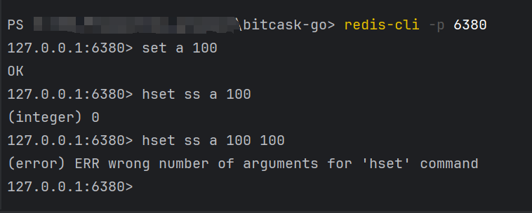

# Bitcask KV存储引擎  

> 获取磁盘空间大小的功能在linux平台暂不支持

基于Bitcask模型，兼容Redis数据结构和协议的KV存储引擎  
**论文地址:**
[Bitcask:A Log-Structured Hash Table for Fast Key/Value Data](https://riak.com/assets/bitcask-intro.pdf)  

## 优点:  
**1、读写低延迟：**  
&nbsp;&nbsp;&nbsp;&nbsp;参考Bitcask存储模型文件的追加写入特性，充分利用顺序IO的优势，可以实现快速读写  
**2、批处理保证原子性、一致性和持久性：**  
&nbsp;&nbsp;&nbsp;&nbsp;支持批处理操作，一次批处理的写入操作要么全部成功，要么全部失败，保证事务原子性  
**3、支持清理磁盘空间无效数据：**  
&nbsp;&nbsp;&nbsp;&nbsp;实现了Bitcask论文中的merge方案，能够对磁盘空间的无效数据进行清理，以达到回收空间的效果  
**4、兼容HTTP协议：**  
&nbsp;&nbsp;&nbsp;&nbsp;单纯KV接口无法作为远程调用服务，在实现的基本接口之上，加上了HTTP接口，可以将存储引擎作为HTTP服务使用  
**5、兼容Redis数据结构：**  
&nbsp;&nbsp;&nbsp;&nbsp;在Redis接口上兼容了Redis的数据结构(**String、List、Hash、Set、ZSet**)

---

|文件|说明|
|:-:|:-:|
|benchmark|基准测试文件|
|data|数据文件定义以及内存索引结构定义|
|example|运行实例|
|fio|文件IO管理接口及其具体实现|
|http|HTTP接口实现|
|index|内存索引结构的具体实现|
|redis|redis数据结构服务|
|batch.go|批处理逻辑的具体实现|
|db.go|bitcask存储引擎方法具体实现|
|error.go|错误信息定义|
|iterator.go|迭代器的具体实现|
|merge.go|用户merge操作的具体实现|
|option.go|存储引擎初始选项设置|

---
## 运行步骤与结果展示:
### 效果展示:
**1、使用HTTP服务进行操作:**  
首先切换到http文件夹，运行指令go run main.go  
新开一个终端，运行指令:  
> 如果是linux系统，请使用以下指令:  
1、curl -X POST localhost:5208/bitcask/put -d '{"name1":"value1":"name2":"value2"}'  
2、curl "localhost:5208/bitcask/get?key=name1"

**2、兼容redis运行:**  
切换到redis/cmd中，运行cmd.exe  
在终端使用命令：redis-cli -p 6380  

 

****
### 基准测试:

